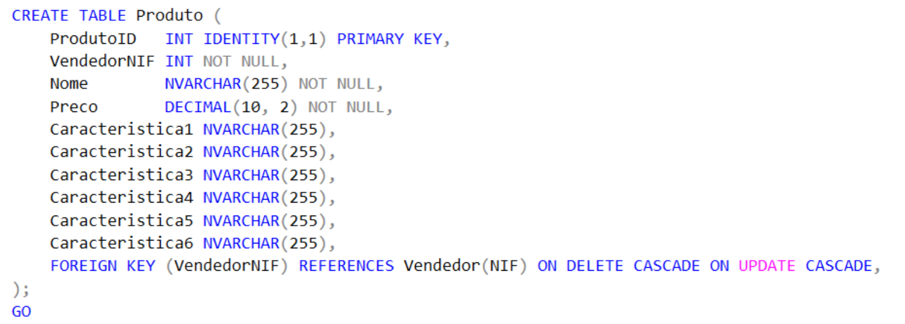
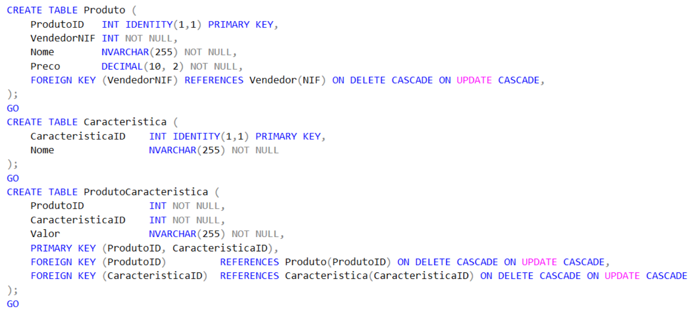

# BD: Trabalho Prático APF-T

**Grupo**: P2G4
- Luís Manuel Trindade Diogo, MEC: 108668
- Nuno Matos Carvalho, MEC: 97783

## Introdução / Introduction
 
MarketChat é uma plataforma que fornece um sistema de chat a um marketplace, em que os utilizadores podem ser clientes (compradores, vendedores ou ambos) ou funcionários. Este sistema permite que os clientes interajam entre si ou com funcionários especialistas, para tirar dúvidas relativas a produtos antes de os comprar.

## ​Análise de Requisitos / Requirements
- Registo de Utilizadores  identificados pelos NIFs, diferenciam-se com os papéis de funcionário e cliente sendo que o cliente pode ser comprador e/ou vendedor.
- Funcionários podem:
	- Registar produtos para vender associados ao seu vendedor. 
	- Responder a mensagens de clientes se forem especialistas no tema.
- Compradores podem: 
	- Fazer pesquisa filtrada dos produtos disponíveis .
	- Iniciar chats com vendedores ou o especialista.
	- Comentar vendedores e avaliar vendedores e comentários.
- Vendedores podem: 
	- Responder a mensagens de clientes.
	- Iniciar chat com o especialista.
	- Uma mensagem ao ser enviada notificará o recetor.


## DER - Diagrama Entidade Relacionamento/Entity Relationship Diagram

### Versão final/Final version


### APFE 

O Produto deixou de ser uma entidade da fraca, para tornar a pesquisa mais leve.
O Chat deixou de usar os NIFs do cliente e do funcionário, e passa a utilizar apenas o NIF do utilizador.
As Mensagens passaram a ser identificiadas unicamente pelo ID, com Triggers para garantir que só são enviadas na conversa a que pertencem.

## ER - Esquema Relacional/Relational Schema

### Versão final/Final Version


### APFE

O Produto deixou de ser uma entidade da fraca, para tornar a pesquisa mais leve.
O Chat deixou de usar os NIFs do cliente e do funcionário, e passa a utilizar apenas o NIF do utilizador.
As Mensagens passaram a ser identificiadas unicamente pelo ID, com Triggers para garantir que só são enviadas na conversa a que pertencem.

## ​SQL DDL - Data Definition Language

[SQL DDL File](sql/01_ddl.sql "SQLFileQuestion")

## SQL DML - Data Manipulation Language

Uma secção por formulário.
A section for each form.

### Formulario exemplo/Example Form


```sql
-- Show data on the form
SELECT * FROM MY_TABLE ....;

-- Insert new element
INSERT INTO MY_TABLE ....;
```

...

## Normalização/Normalization

Exemplo: Normalização da tabela produto.

### Antes:



### Depois:



O código estava redundante com a possibilidade de muitas colunas serem NULL levando a desperdício de espaço. Além disso acrescentar novas características requeria alterar a estrutura da tabela, e era dificil gerenciar esta tabela com o aumento do número de colunas.


## Índices/Indexes

O nosso projeto não tem índices porque usámos as chaves primárias para fazer pesquisas, e estas já vêm indexadas.

## SQL Programming: Stored Procedures, Triggers, UDF
- sp para garantir a integridade das relacoes is-a de completude total
- triggers para garantir a disjuncao da relacao is-a entre funcionario e cliente
- triggers para garantir a eliminacao correta de dados 
- triggers para restringir as opcoes de criacao de chats e de mensagens entre utilizadores
- trigger de verificacao que o vendedor do produto existe
- sp para a insercao de caracteristicas a um produto, de modo a nao criar duplicacao de dados
- view para a criacao de uma tabela virtual com os produtos e as suas caracteristicas para uso posterior em UDF
- UDF para pesquisar produtos por caracteristicas, utilizando a tabela virtual criada
- view para a criacao de uma tabela virtual os valores que disponiveis para o filtro
- 3 views para a criacao de três tabelas virtuais com os vendedores, os compradores e os funcionários juntamente com os seus respetivos chats

[SQL SPs and Functions File](sql/02_sp_functions.sql "SQLFileQuestion")

[SQL Triggers File](sql/03_triggers.sql "SQLFileQuestion")

## Outras notas

### Dados iniciais da dabase de dados

[DML File](sql/01_ddl.sql "SQLFileQuestion")

### Outros

[UDF file](sql/05_udf.sql)

[Views](sql/06_views.sql)

### Apresentação

[Slides](slides.pdf "Slides")

[Video](https://elearning.ua.pt/pluginfile.php/55992/mod_label/intro/VideoTrabalho2013.mp4)


 